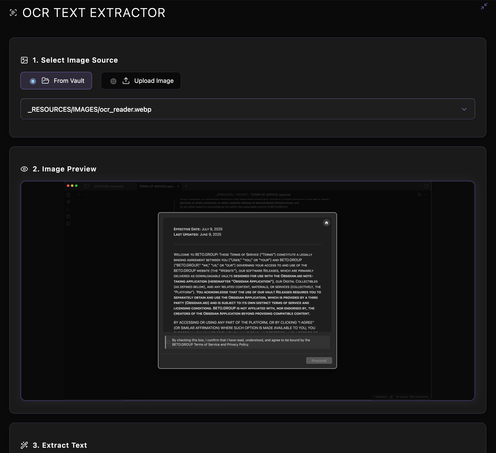
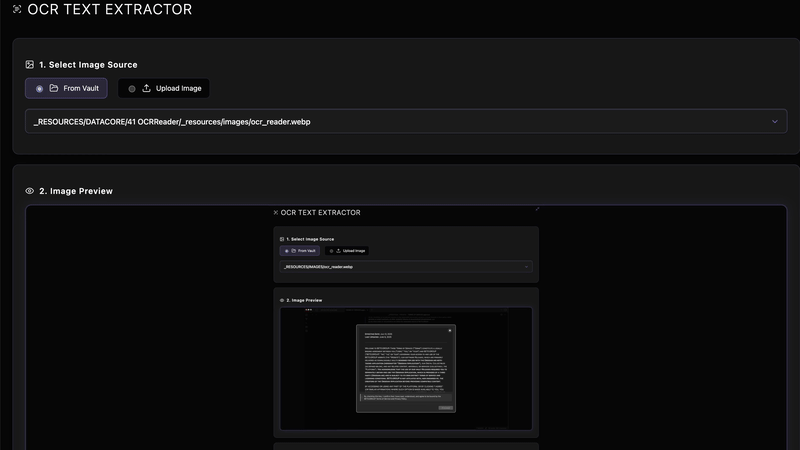

  
  
  <h1 align="center">OCR READER</h1>
  <h3 align="center"> A Cʟɪᴇɴᴛ-Sɪᴅᴇ OCR Tᴏᴏʟ ғᴏʀ Obsidian </h3>

  <!-- TOP PURPLE LINKS -->
  
  
  
   
  <!-- BOTTOM GOLD TAXONOMY -->
  
  
  
  

  
<i>A client-side Optical Character Recognition (OCR) tool that extracts text from vault images, uploads, or clipboard content using Tesseract.js, featuring offline caching.</i>

---

## 📌 Introduction & Overview

**OCR Reader** is a comprehensive and user-friendly text extraction utility designed to run directly inside your Obsidian vault. Using the powerful `Tesseract.js` library, it processes images from multiple sources completely client-side.

The interface supports dragging and dropping image files, copying directly from the clipboard, or selecting image assets directly from the vault using an intuitive selection menu, all inside a polished full-pane dashboard.

---

## ✨ Features

### 📋 Multi-Source Processing
*   **Vault Selection**: Automatically indexes all image attachments (`.png`, `.jpg`, `.webp`, etc.) in the vault for quick selection.
*   **Drag & Drop**: Easily drop local desktop images directly into the loading area.
*   **Clipboard Pasting**: Copy any screen snippet and press `Ctrl/Cmd+V` to paste it instantly.

### 🛡️ Runtime & Offline Caching
*   **Dynamic Script Loading**: Safely fetches Tesseract.js from public CDNs on first run.
*   **Offline Script Caching**: Saves the downloaded script to a local vault directory (`.datacore/script_cache`) to enable full offline operation on subsequent loads.
*   **Lucide Visual Icons**: Implements custom SVG layout symbols throughout the interface.

---

## 📦 Directory Index & Components

The package exposes the following compiled files:

| File | Description |
| :--- | :--- |
| **[OCR READER.md](OCR%20READER.md)** | Standard Obsidian active rendering leaf |
| **[src/index.jsx](src/index.jsx)** | Default view bootstrapper and agent daemon loop |
| **[src/App.jsx](src/App.jsx)** | Main layout orchestrator coordinating inputs and OCR state |
| **[src/utils/loadScript.js](src/utils/loadScript.js)** | Local script downloader and local script cache manager |
| **[src/utils/domUtils.js](src/utils/domUtils.js)** | DOM helper utilities supporting full-tab reparenting |
| **[data/mcp_commands.json](data/mcp_commands.json)** | Hot Module Replacement (HMR) daemon polling command descriptor |
| **[METADATA.md](METADATA.md)** | Universal metadata manifest |
| **[CONTRIBUTION.md](CONTRIBUTION.md)** | Engineering standards and contributor guidelines |
| **[LICENSE.md](LICENSE.md)** | The MIT permissible software distribution license |
